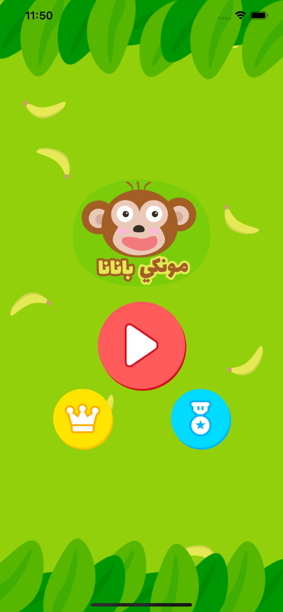

A flutter package to help you scale your design on bigger or smaller screens to achieve the same design look.

## Screenshot  

iPhone 8, iPhone X Max, iPad Pro 12.9

  

*This screenshots from my app, it's available on [AppStore](https://apps.apple.com/gm/app/id1514479049) and [PlayStore](https://play.google.com/store/apps/details?id=com.jostudio.logz)*

## Usage  

First of all, in your base widget setup `Scale`.
So, if you have a design with 1280 * 720. You will pass first the context then the design size.

``` dart
Scale.setup(context, Size(1280, 720));
```

### Scale relative to height
Now to scale a number relative to screen height

``` dart
final height = Scale.scaleVertically(50);
```

Or, you can use the extension
``` dart
final height = 50.sv;
```

### Scale relative to width

To scale a number relative to screen height

``` dart
final height = Scale.scaleHorizontally(50);
```

Or, you can use the extension
``` dart
final height = 50.sh;
```

### Scale font

The font will be scaled relative to screen width, to do that:

``` dart
final fontSize = Scale.scaleFont(17);
```

Or, you can use the extension
``` dart
final fontSize = 17.sf;
```

## Installing  

Simply add the following line to your pubspec.yaml file:  
``` yaml
dependencies:
  scale: any       # <-- Add this line
```